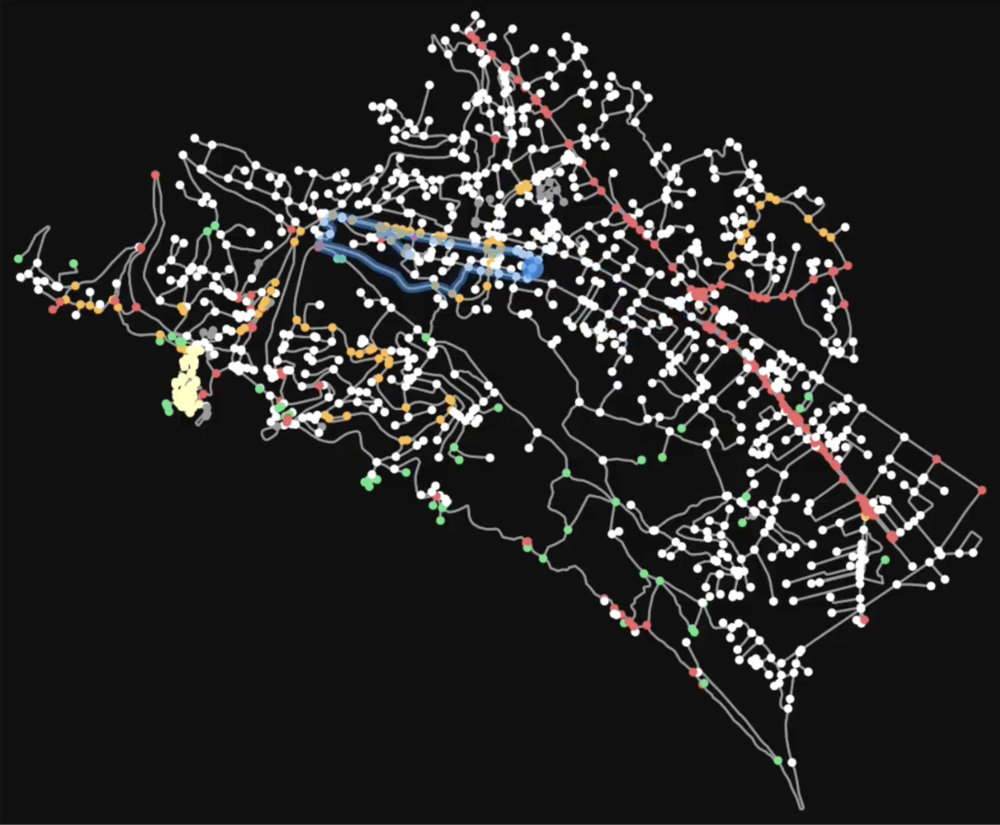
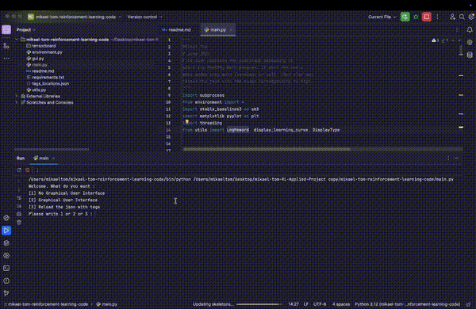

# HealthyWalk : Reinforcement Learning

Project developed as part of the **Reinforcement Learning** course (Vrije Universiteit Brussel).

Author : Mikael Tom 

Date : 4 June 2026

Grade: 20/20



[Watch the Project Demo on YouTube](https://youtu.be/BUKwm1gV2OY)

This project builds a custom OpenAI Gym / Gymnasium environment in which a PPO agent (Stable-Baselines3) learns to construct closed-loop walking routes in Ulqin, Montenegro, tailored to a user-requested duration and to what actually makes a walk pleasant. The full methodology, design rationale, failed attempts, and results are documented in [`report.pdf`](./report.pdf).


## Why This Project Matters

Walking is one of the simplest ways to improve mood and health, but knowing where to go is often the real barrier. Most people default to the same handful of routes tied to a destination (school, work, groceries) rather than walking for its own sake. This is even more pronounced in places with weak pedestrian infrastructure. Ulqin, Montenegro was chosen precisely because of its scarce sidewalks and low walking culture, where short trips are often done by car instead of on foot. Framing "suggest a good walk" as a sequential decision problem lets an RL agent balance competing goals, matching a target duration, favoring pleasant and safe segments, avoiding hazards, reaching points of interest, better than a hand-tuned heuristic, and it can be personalized further with direct user feedback.



## How It Works

Map data for Ulqin is downloaded via OSMnx/OpenStreetMap and enriched with tags describing nature and scenery, "must-visit" places (monuments, historical sites), amenities, places to avoid (busy or fast roads, poor-quality tracks, cemeteries, military land), and pedestrian-safe places.

At each step, the environment proposes a candidate segment, sampled from a distance ring around the last accepted node; the sampling radius shrinks as the walk approaches its target duration to keep exploration tractable. The agent's only decision is binary: accept or reject. If accepted, the segment is stitched into a closed loop back to the start using NetworkX shortest paths, so a valid loop exists after every step.

The 16-dimensional observation encodes timing (requested, current, and projected loop duration), the quality ratios of the proposed segment, spatial coordinates (current position, candidate, and the "must-visit" landmark), distance from the start, and a dead-end flag. The reward combines segment quality, a penalty for dead ends and for exceeding the requested time, a bonus for finishing close to the target duration, optional user ratings, and potential-based reward shaping that guides the agent toward the far-away "must-visit" landmark.

The agent is trained with PPO (Stable-Baselines3) for 40,000 timesteps, and the resulting policy converges toward generating consistently good walks (see the learning curve in the report).

## Features

- Real-world map data pipeline via OSMnx/OpenStreetMap, cached to a local JSON file
- Custom Gym/Gymnasium environment with a compact binary action space (accept/reject)
- Dynamic closed-loop construction at every step using NetworkX shortest paths
- Configurable walk duration (5-50 minutes), respected via the reward function and episode termination logic
- Adaptive, distance-aware candidate sampling to keep the action space tractable
- PPO training via Stable-Baselines3, with TensorBoard logging
- Two run modes: a lightweight terminal mode and an interactive Streamlit GUI mode
- Optional human-in-the-loop feedback: rate proposed loops (1-5) during GUI training to shape the reward
- On-demand reload of the latest OpenStreetMap tags without touching the code

## Demonstration

You can watch a full demonstration of the GUI mode here: [Watch the Project Demo on YouTube](https://youtu.be/BUKwm1gV2OY)

## Dependencies

This project uses: streamlit, tensorboard, stable-baselines3, matplotlib, gymnasium, numpy, osmnx, networkx, scikit-learn, and geopandas.

Install everything with:

```bash
pip install -r requirements.txt
```

## How to Run

All source files live in [`src/`](./src). The entry point is [`src/main.py`](./src/main.py).

```bash
python src/main.py
```

Once launched, you'll be prompted to choose one of three options:

**Option 1 — Terminal Mode**
Trains the agent headlessly and outputs the final learning curve at the end.

**Option 2 — Graphical User Interface Mode**
Lets you watch the agent train in real time and inspect its behavior via TensorBoard. If enabled, you can also give live feedback (a 1-5 rating) on proposed loops, which is fed back into the reward.

- App: open your browser at the local address printed by Streamlit (default [http://localhost:8501](http://localhost:8501))
- TensorBoard: available at [http://localhost:6006](http://localhost:6006)

**Option 3 — Reload OpenStreetMap Tags (optional)**
Dynamically re-fetches the latest OpenStreetMap tags for Ulqin, so the cached map and quality data used by the environment stays up to date.

## Report

A full write-up of the methodology, design iterations (including what didn't work), the environment, state, action, and reward design, and the results is available in [`report.pdf`](./report.pdf).

## References

Saelens, B. E., & Handy, S. L. (2008). Built environment correlates of walking: A review. *Medicine & Science in Sports & Exercise*, 40(7), S550-S566. https://doi.org/10.1249/MSS.0b013e31817c67a4
